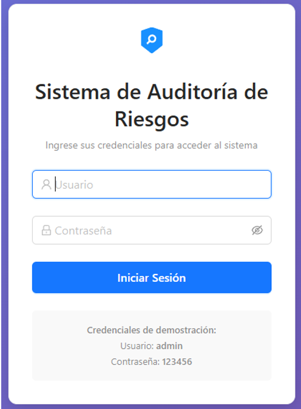

# Exa_U1_Meza
# Informe de Auditoría de Sistemas - Examen de la Unidad I

**Nombres y apellidos:**  Jean Marco Meza Noalcca

**Fecha:**  10/09/2025

**URL GitHub:**  https://github.com/mezamarco14/Exa_U1_Meza

---

## 1. Proyecto de Auditoría de Riesgos

### Login  
**Evidencia:**  
  

**Descripción:**  
Se implementó un inicio de sesión ficticio sin base de datos, utilizando credenciales predefinidas. El sistema valida usuario y contraseña, genera un token de sesión simulado y lo guarda en `localStorage`. Esto permite acceder a las funcionalidades del sistema sin necesidad de un servidor real.  

---

### Motor de Inteligencia Artificial  
**Evidencia:**  
  

**Descripción:**  
Se mejoró el motor de IA integrando un módulo que analiza activos de información y genera automáticamente perfiles de riesgo, impactos y recomendaciones de mitigación basadas en ISO 27001. El sistema asigna un nivel de riesgo (bajo, medio o alto) según criterios definidos y presenta las recomendaciones al auditor.  

---

## 2. Hallazgos

### Activo 1: Servidor de Base de Datos  
**Evidencia:**  
  

**Condición:**  
Se encontró que las conexiones al servidor no están cifradas, lo cual expone datos sensibles.  

**Recomendación:**  
Implementar cifrado TLS en todas las conexiones y restringir accesos solo a direcciones IP autorizadas.  

**Riesgo:** Alta  

---

### Activo 2: API de Transacciones  
**Evidencia:**  
  

**Condición:**  
La API no cuenta con limitación de peticiones (rate limiting), lo que puede permitir ataques de denegación de servicio.  

**Recomendación:**  
Configurar políticas de rate limiting y autenticación robusta mediante tokens de corta duración.  

**Riesgo:** Media  

---

### Activo 3: Aplicación Web de Banca  
**Evidencia:**  
  

**Condición:**  
No se encontró protección contra ataques de inyección SQL en algunos formularios.  

**Recomendación:**  
Implementar validación estricta de entradas y uso de consultas parametrizadas.  

**Riesgo:** Alta  

---

### Activo 4: Firewall Perimetral  
**Evidencia:**  
  

**Condición:**  
Las reglas del firewall no están actualizadas, permitiendo tráfico innecesario desde redes externas.  

**Recomendación:**  
Revisar y actualizar las políticas de firewall regularmente, aplicando el principio de mínimo privilegio.  

**Riesgo:** Media  

---

### Activo 5: Backup en NAS  
**Evidencia:**  
  

**Condición:**  
Los respaldos no cuentan con cifrado en reposo.  

**Recomendación:**  
Configurar cifrado AES-256 para los respaldos almacenados en NAS y establecer controles de acceso.  

**Riesgo:** Alta  

---

## Anexo 1: Activos de información  
*(Según listado proporcionado en el enunciado del examen)*  

---

## Anexo 2: Rúbrica de Evaluación  
- Login ficticio completo y funcional: **5 pts**  
- IA implementada y funcionando con evidencia clara: **5 pts**  
- 5 activos evaluados con hallazgos claros y evidencias: **5 pts**  
- Informe bien estructurado y completo: **5 pts**  

**Total: 20 pts**
