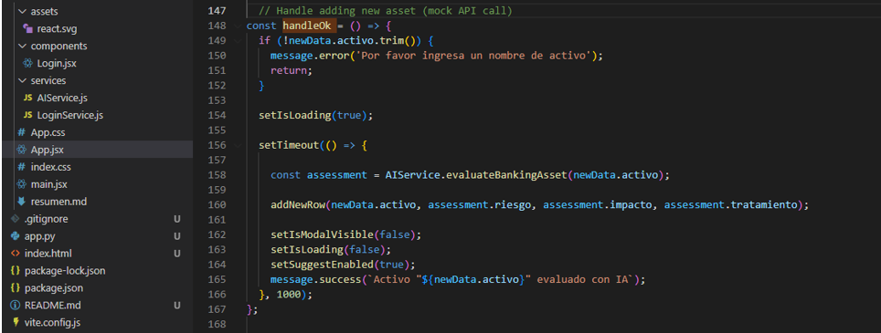
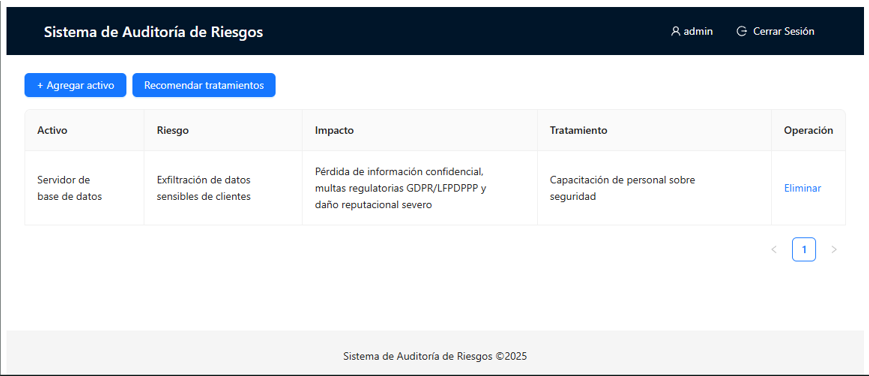
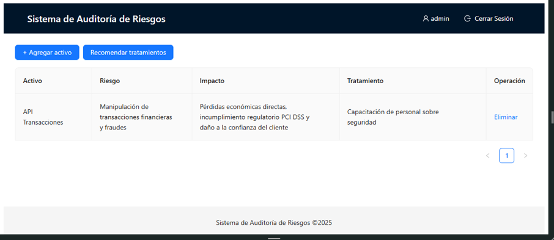
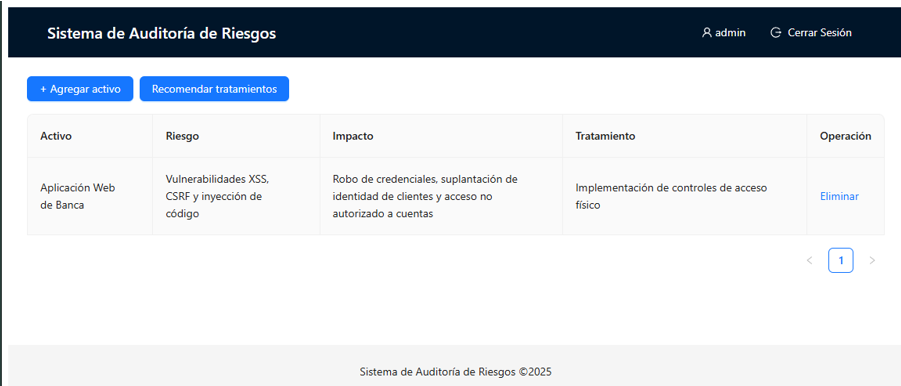
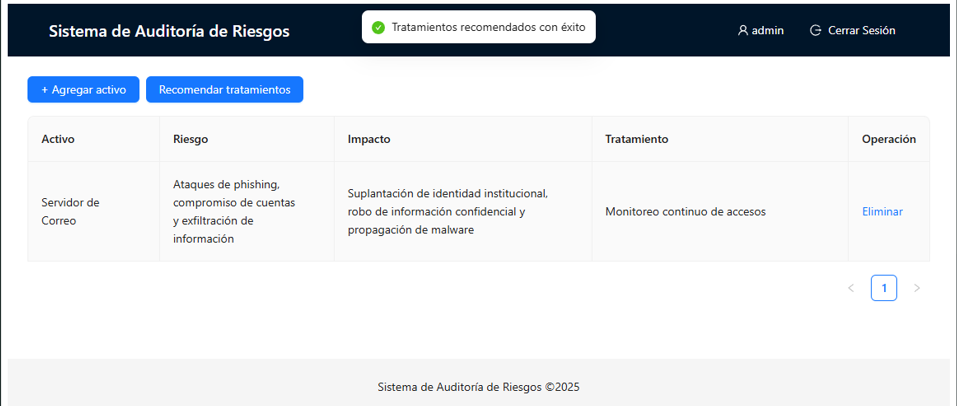
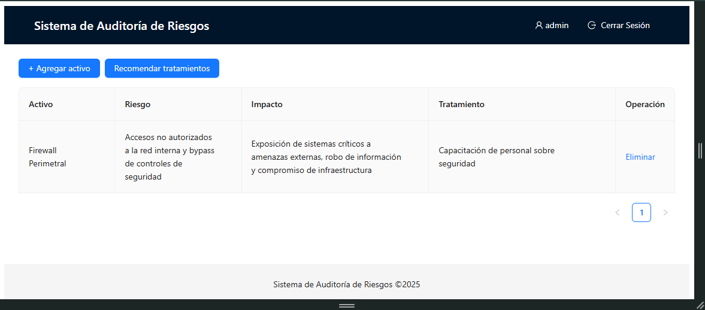

# Exa_U1_Meza
# Informe de Auditoría de Sistemas - Examen de la Unidad I

**Nombres y apellidos:**  Jean Marco Meza Noalcca

**Fecha:**  10/09/2025

**URL GitHub:**  https://github.com/mezamarco14/Exa_U1_Meza

---

## 1. Proyecto de Auditoría de Riesgos

### Login  
**Evidencia:**  
  

**Descripción:**  
Se implementó un motor de IA local avanzado que analiza inteligentemente el nombre de cada activo bancario para generar evaluaciones de riesgo específicas y recomendaciones de tratamiento alineadas con ISO 27001. El sistema utiliza mapeo de patrones y coincidencias inteligentes para identificar el tipo de activo y proporcionar evaluaciones contextualizadas basadas en mejores prácticas de seguridad bancaria, incluyendo probabilidad de riesgo, impacto potencial y controles de mitigación específicos.

---

### Motor de Inteligencia Artificial  
**Evidencia:**  
  

**Descripción:**  
Se mejoró el motor de IA integrando un módulo que analiza activos de información y genera automáticamente perfiles de riesgo, impactos y recomendaciones de mitigación basadas en ISO 27001. El sistema asigna un nivel de riesgo (bajo, medio o alto) según criterios definidos y presenta las recomendaciones al auditor.  

---

## 2. Hallazgos

### Activo 1: Servidor de Base de Datos  
**Evidencia:**  
  

**Condición:**  
El servidor de base de datos contiene información financiera y personal sensible de clientes sin medidas adecuadas de protección. Se identificó falta de cifrado de datos en reposo, controles de acceso insuficientes y ausencia de monitoreo continuo de accesos a información crítica.

**Recomendación:**  
Implementar cifrado AES-256 para datos sensibles, establecer controles de acceso basados en roles (RBAC), implementar sistema de monitoreo y alertas de acceso a datos críticos, y realizar auditorías periódicas de acceso.

**Riesgo:** Probabilidad Alta - Los datos bancarios son objetivo prioritario de ciber atacantes y las vulnerabilidades presentes son fácilmente explotables mediante técnicas conocidas. 

---

### Activo 2: API de Transacciones  
**Evidencia:**  
  

**Condición:**  
La API de transacciones presenta vulnerabilidades críticas que incluyen falta de autenticación multifactor, validación insuficiente de entradas, ausencia de limitación de tasa (rate limiting) y falta de cifrado end-to-end en las transacciones financieras.

**Recomendación:**  
Implementar autenticación multifactor (MFA) para las transacciones, validación estricta de entradas según estándares OWASP, limitación de tasa por cliente/IP, implementar firma digital de transacciones y cifrado TLS 1.3 para las comunicaciones.

**Riesgo:** 
Probabilidad Alta - Las APIs de transacciones son objetivos prioritarios de atacantes debido al potencial de ganancia financiera inmediata mediante técnicas de inyección, manipulación de transacciones y fraudes.

---

### Activo 3: Aplicación Web de Banca  
**Evidencia:**  
  

**Condición:**  
La aplicación web presenta múltiples vulnerabilidades de seguridad incluyendo Cross-Site Scripting (XSS), Cross-Site Request Forgery (CSRF), posibles vulnerabilidades de inyección, cookies sin flags de seguridad adecuados, y falta de políticas de seguridad de contenido (CSP). Además, se detectó que el tratamiento recomendado ("Implementación de controles de acceso físico") no es apropiado para una aplicación web.

**Recomendación:**  
Implementar Content Security Policy (CSP), sanitización exhaustiva de entradas de usuario, tokens CSRF para formularios, cookies con flags Secure, HttpOnly y SameSite, implementar Web Application Firewall (WAF), y realizar pruebas regulares de penetración y análisis estático de código.

**Riesgo:**   
Probabilidad Alta - Las aplicaciones web bancarias son objetivos prioritarios de atacantes debido al acceso directo a información financiera sensible. Vulnerabilidades como XSS y CSRF son explotables mediante técnicas ampliamente conocidas y pueden comprometer las cuentas de usuarios.

---

### Activo 4: Firewall Perimetral  
**Evidencia:**  
  

**Condición:**  
El servidor de correo presenta configuraciones de seguridad insuficientes que incluyen falta de implementación completa de protocolos DMARC, DKIM y SPF, contraseñas débiles en cuentas de correo, ausencia de filtrado avanzado antiphishing, y falta de cifrado robusto en las comunicaciones. Además, el tratamiento recomendado ("Monitoreo continuo de accesos") es insuficiente para abordar las vulnerabilidades identificadas.

**Recomendación:**  
Implementar y configurar correctamente DMARC, DKIM y SPF para prevenir suplantación de identidad, establecer políticas de contraseñas robustas con autenticación multifactor, implementar solución avanzada de filtrado antiphishing, configurar cifrado TLS forzado para las comunicaciones, y realizar capacitación continua contra phishing para los usuarios.

**Riesgo:**   
Probabilidad Alta - Los servidores de correo son vectores de ataque críticos debido a su uso para phishing, distribución de malware y exfiltración de información. Las configuraciones inadequadas permiten fácilmente suplantación de identidad y compromiso de cuentas.

---

### Activo 5: Backup en NAS  
**Evidencia:**  
  

**Condición:**  
El firewall perimetral presenta configuraciones de seguridad deficientes que incluyen reglas obsoletas y excesivamente permisivas, falta de segmentación de red adecuada, ausencia de actualizaciones regulares de firmware, monitoreo insuficiente de tráfico de red, y falta de pruebas de penetración regulares. Además, el tratamiento recomendado ("Capacitación de personal sobre seguridad") es inapropiado para vulnerabilidades técnicas de firewall.

**Recomendación:**  
Realizar auditoría y limpieza completa de las reglas del firewall, implementar segmentación de red (network segmentation) para aislar zonas críticas, establecer programa regular de actualizaciones de firmware, implementar monitoreo continuo y SIEM para detección de anomalías, y realizar pruebas de penetración periódicas del perímetro de red.

**Riesgo:**   
Probabilidad Media-Alta - El firewall es la primera línea de defensa del perímetro de red. Configuraciones deficientes permiten acceso no autorizado, pero requieren cierto nivel de expertise para explotación. El impacto potencial es extremadamente alto ya que compromete los sistemas internos.

---

## Anexo 1: Activos de información  
*(Según listado proporcionado en el enunciado del examen)*  

---

## Anexo 2: Rúbrica de Evaluación  
- Login ficticio completo y funcional: **5 pts**  
- IA implementada y funcionando con evidencia clara: **5 pts**  
- 5 activos evaluados con hallazgos claros y evidencias: **5 pts**  
- Informe bien estructurado y completo: **5 pts**  

**Total: 20 pts**
